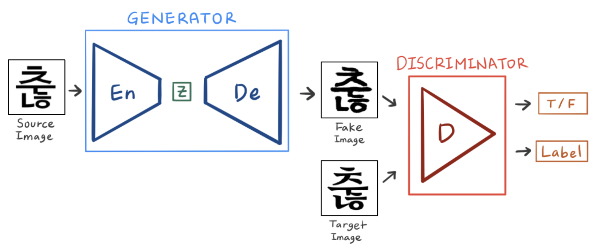
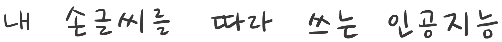
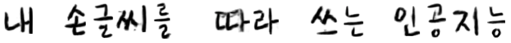

[한글 버전](https://github.com/jeina7/Handwriting_styler/blob/master/readme_korean.md#my-handwriting-styler-%EB%82%B4-%EC%86%90%EA%B8%80%EC%94%A8%EB%A5%BC-%EB%94%B0%EB%9D%BC%EC%93%B0%EB%8A%94-%EC%9D%B8%EA%B3%B5%EC%A7%80%EB%8A%A5)

# My Handwriting Styler, with GAN & U-Net


　    


<p align="center"></p>
<p align="center">Left : Generated Image / Right : Ground Truth</p>


　    


## \# Introduction
This is a project that trains GAN-based model with the human handwriting, and generates the character images that reflect their styles. Before learning human handwriting, it should be pre-trained on a large amount of digital font character images, and then it does transfer learning with small amounts of human handwritten character images.


All details about this project can be seen in the [blog post](https://jeinalog.tistory.com/15). (in Korean)


　     


## \# Model Architecture
<p align="center"></p>

The basic model architecture is GAN, which consists of Generator and Discriminator.
- **Generator** gets Gothic type image for input, and do the style transfer with it. It has Encoder and Decoder inside, which is the different point from Vanilla GAN. Generator improves the quality of generated image during evaluated by Discriminator.
- **Discrinimator** gets Real or Fake images, and calculate the probability of them to be the real image. At the same time, it also predicts the category of the font type.


　     


<p align="center"></p>


　     


It is 3D image of Encoder and Decoder. After the Encoder extracts features of image, the font category vector is concatenated at the end of the feature vector. Also, the middle-step extracted vectors goes to the pair-vectors which are decoded by Decoder. This architecture is [U-Net](https://arxiv.org/abs/1505.04597).


　    


## \# Pre-Training
> Pre-Training processes are inspired and helped by [zi2zi](https://github.com/kaonashi-tyc/zi2zi) project of [kaonashi-tyc](https://github.com/kaonashi-tyc).


　    


<p align="center"></p>
<p align="center">[Pre-Training] Data : 75,000 images / 150 epoch</p>


　     


At first, the model trains 150epoch from the scratch.

- 1~30epoch : `L1_penalty=100`, `Lconst_penalty=15`
- 31~150epochh : `L1_penalty=500`, `Lconst_penalty=1000`


Until 30epoch, where is early stage yet, we give more weight to L1 loss to let the model learn overall shape first. After that, constant loss will be more weighted to make model learn more details and make them sharper. Constant loss has introduced in [DTN](https://arxiv.org/abs/1611.02200).


　    


## \# Transfer Learning: Handwriting
<p align="center"></p>
<p align="center">[Transfer Learning] Data : 210 images / 550 epoch</p>


　     


150epoch Pre-trained model now learns human handwriting. GIF shows the process of learning from 151epoch to 550epoch. It is lot more epochs, but it takes much shorter because of little amount of data.


　    


<p align="center"></p>


　     


<p align="center"></p>


　     


The upper image is Ground Truth written by human, and the lower image is generated fake image.   
All 13 Korean characters written in image are not contained in the training data set. It represents that model can generate unseen characters even if it has been trained with only part of all Korean character set.


　    


## \# Interpolation
<p align="center"></p>


　    


Interpolation is the experiment to explore the latent space which model learned, which has been introduced in [DCGAN](https://arxiv.org/abs/1511.06434). The GIF shows that there are middle-font between one type of the font and another. It is the evidence that model has trained the category vector space properly, not just 'memorizing' characters.


　    


## \# Codes
```
common
├── dataset.py    # load dataset
├── function.py   # deep learning functions : conv2d, relu etc.
├── models.py     # Generator(Encoder, Decoder), Discriminator
├── train.py      # model Trainer
└── utils.py      # data pre-processing etc.

get_data
├── font2img.py   # font.ttf -> image
└── package.py    # .png -> .pkl
```


　    


## \# Acknowledgements
Code derived and rehashed from:

- [zi2zi](https://github.com/kaonashi-tyc/zi2zi) by [kaonashi-tyc](https://github.com/kaonashi-tyc)
- [tensorflow-hangul-recognition](https://github.com/IBM/tensorflow-hangul-recognition) by [IBM](https://github.com/IBM)
- [pix2pix-tensorflow](https://github.com/yenchenlin/pix2pix-tensorflow) by [yenchenlin](https://github.com/yenchenlin)
- [Domain Transfer Network](https://github.com/yunjey/domain-transfer-network) by [yunjey](https://github.com/yunjey)
- [ac-gan](https://github.com/buriburisuri/ac-gan) by [buriburisuri](https://github.com/buriburisuri)
- [dc-gan](https://github.com/carpedm20/DCGAN-tensorflow) by [carpedm20](https://github.com/carpedm20)
- [origianl pix2pix torch code](https://github.com/phillipi/pix2pix) by [phillipi](https://github.com/phillipi)


　    


## \# Lisence
Apache 2.0
